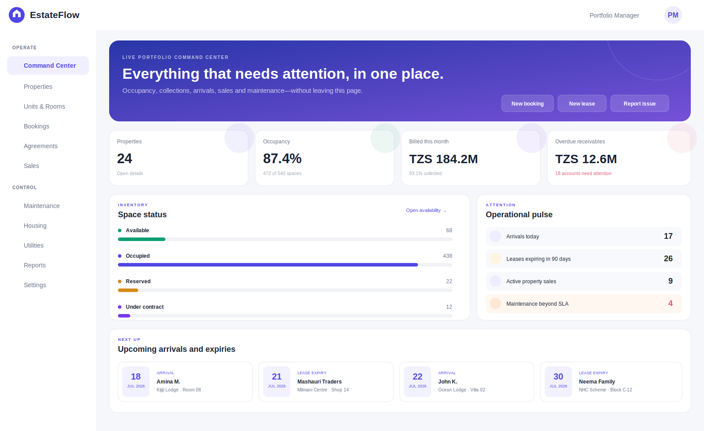
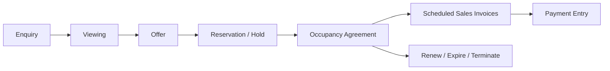
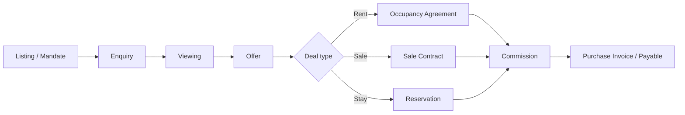
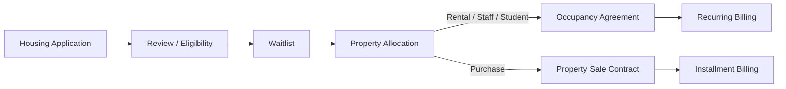

# EstateFlow for ERPNext

**One seamless operating system for houses, rentals, hotels, lodges, property agents, developers, national housing, facilities and real-estate portfolios.**

> Compatibility target: ERPNext/Frappe 15 and 16 · License: MIT · Current build: `0.1.5`

EstateFlow is an upgrade-safe Frappe application. It uses ERPNext Accounts, Selling, Buying, Stock, Assets, CRM and Projects instead of building a disconnected property ledger. A one-house landlord can start with a property and a tenant; a housing authority or hotel group can use portfolios, hundreds of properties, thousands of spaces, approvals and role separation.



*The preview uses illustrative data. The shipped Command Center reads live ERPNext data.*

---

## Why EstateFlow

Most property systems solve only one part of the work. A booking system does not manage long leases. A rent tool does not handle hotel rooms. An agent CRM does not handle maintenance, procurement or accounting. EstateFlow uses one adaptable structure:

```text
Portfolio → Property / Hotel / Scheme → Building or Zone → Unit / Room / Plot / Bed / Shop / Space
```

Every operational document points back to the same property and space. Users can move from an enquiry to a viewing, reservation, agreement or sale without entering the same information again. Every bill can carry the property, unit, agreement, reservation and sale-contract references into ERPNext Accounts.

## Who can use it?

| Business | Start-simple experience | Scalable experience |
|---|---|---|
| Individual landlord | Add houses, tenants, rent and maintenance | Arrears, recurring invoices, inspections, portfolio P&L |
| Property manager | Manage an owner's properties and tenants | Multi-owner portfolios, work orders, property-level dimensions |
| Hotel or lodge | Rooms, guests, availability, check-in/out and folio invoice | Multiple hotels, arrivals, housekeeping, procurement and utilities |
| Real-estate agent | Listings, leads, viewings, offers and rent/sale deals | Agent assignment, sales partners, commission payable |
| Developer | Unit inventory, reservations and sales contracts | Installment billing, milestones, handover dates and commissions |
| National/social housing | Applicant, eligibility, waitlist and allocation records | Housing schemes, approved allocation, tenancy or purchase conversion |
| Commercial/retail operator | Shops, offices, rent and recurring service charges | Lease expiries, service billing, maintenance and cost-centre reporting |
| Student/staff housing | Rooms or beds, allocation and occupancy agreements | Institution-wide schemes, utilities and maintenance |
| Co-working operator | Desks, rooms and memberships | Short reservations, recurring occupancy and operational reporting |
| Industrial/warehouse operator | Warehouses and industrial units | Lease administration, procurement, assets and maintenance |
| Investment portfolio / REIT | Portfolio, ownership references and property performance dimensions | ERPNext financial statements by property, project and cost centre |
| HOA/strata/community | Common property, owner/occupant and maintenance foundation | Community levies and advanced owner accounting are planned extensions |

Business modes are switches—not separate editions. A business can enable **Hotel/Lodge + Property Management + Brokerage** on the same site.

---

## Current implementation

### Universal property inventory

- Configurable Portfolio → Property → Space hierarchy
- Residential, commercial, mixed-use, hotel, lodge, serviced apartment, social housing, retail, office, industrial, warehouse, land, co-working and community property types
- Houses, apartments, villas, hotel/lodge rooms, beds, shops, offices, warehouses, plots, parking, storage, desks and other spaces
- Multiple purposes per space: long-term rent, sale, short stay and housing allocation
- Area, capacity, room/bed counts, furnishing, accessibility, amenities and images
- Physical status, occupancy status and housekeeping status kept separately
- Property-level company, currency, cost centre, project, warehouse, income account and expense account defaults
- Live total and available-space counts

### Leasing and occupancy



- Residential, commercial, staff, student and social-housing agreements
- Agreement term, notice period and renewal indicator
- Monthly, quarterly, half-yearly, yearly or one-time billing
- Multiple recurring charge rows for rent, service charge, parking, utilities, insurance, HOA levy and management fees
- Security-deposit receipt, refund, invoice application and adjustment transactions
- Accountant-controlled Journal Entries between bank, liability, receivable and adjustment accounts
- Live deposit balance on the occupancy agreement
- Double-occupancy prevention with clear conflict messages
- Submission sets the space to occupied and links the current customer/agreement
- Daily scheduler generates missing due periods safely and prevents duplicate invoices
- Agreement invoice action for authorized users
- Rent Roll and Lease Expiry reports

### Hotel, lodge and short-stay operations


- Hotel/lodge stay reservation type
- Arrival, departure, adults, children, guest identity and vehicle data
- Room capacity validation
- Night calculation and room-rate calculation
- Additional accommodation, meal, laundry, transport, utility, tax, discount and other charges
- Configurable check-in/check-out defaults
- Confirm, check-in, invoice and check-out buttons displayed only at the correct step
- Check-out can mark the room dirty automatically
- Housekeeping work orders return a room to clean status
- Today's arrivals and upcoming arrivals on the Command Center
- Half-open availability intervals: a new guest can arrive on the previous guest's departure date

### Agent, listing and sales operations



- Rent, sale, short-stay and housing listings
- Owner, sales partner, internal agent, channel, asking price and listing validity
- Enquiries for rent, purchase, short stay, housing or management services
- Viewing schedule, assigned agent, visitor feedback and next action
- Offers with validity, amount, dates, deposits and commission rate
- Sale contracts and milestone/installment tables
- Installment totals must equal contract value; optional percentages must total 100%
- Due installment invoice generation with duplicate protection
- Installment status updates from ERPNext Sales Invoice outstanding amount
- Sale subject to an existing tenancy when explicitly selected
- Internal agent, sales partner or supplier-based commission records
- Approved supplier commission can create an ERPNext Purchase Invoice

### National, social, staff and student housing



- Social rental, affordable purchase, staff, student, emergency and general applications
- Applicant identity, household, dependants, income, special needs and supporting documents
- Eligibility result, reviewer, score field and waitlist-ready status
- Proposed, approved, accepted, declined and converted allocation states
- Allocation validates property/space eligibility and availability
- One-click conversion to a housing occupancy agreement or sale contract

> EstateFlow stores the policy inputs but does not impose a universal eligibility formula. Each housing authority should implement its approved allocation policy and audit controls.

### Maintenance, facilities and supply chain


- Corrective, preventive, turnover, emergency and inspection-finding requests
- Priority-based SLA due date
- Internal technician or external supplier assignment
- Planned and actual dates, instructions, completion and verification notes
- Materials table with item, required quantity, warehouse and issued quantity
- Work Order → ERPNext Material Request creation
- EstateFlow fields on Material Request, Purchase Order, Purchase Receipt, Stock Entry and Purchase Invoice
- Inspection checklists, pass score, photos and maintenance flags
- One-click maintenance requests from failed inspection items
- Housekeeping, unit turnover and cleaning work orders

### Utilities

- Electricity, water, gas, solar, generator and other meters
- Property-level or unit-level meter
- Actual, estimated, opening and final readings
- Previous reading and consumption calculation
- Prevents decreasing readings, except the explicit opening process
- Rate-per-unit billing
- Current occupant defaults as bill-to customer
- Submitted reading can create an ERPNext Sales Invoice

---

## Command Center

The custom `EstateFlow Command Center` is a responsive Frappe Desk page. It gives an executive or operator one filtered view of:

- Properties and units/rooms/spaces
- Available, reserved, occupied, under-contract and sold inventory
- Occupancy percentage
- Billed revenue and collection rate for the selected period
- Overdue property receivables
- Open maintenance and SLA breaches
- Today's arrivals
- Leases expiring within 90 days
- Active property sales
- Upcoming arrivals and lease expiries
- One-click actions for booking, leasing, maintenance, enquiries, housing and meter readings

Filters are available for company, property and date period. Every card drills into the relevant ERPNext list or report.

### Guided setup

The first visit opens a setup dialog. A user chooses:

1. Company
2. Familiar label: Property, Estate, Hotel, Lodge, Housing Scheme or Development
3. Relevant business modes
4. Whether EstateFlow should create safe non-stock billing service Items
5. Whether it should create an initial portfolio

EstateFlow deliberately **does not silently create tax accounts, trust accounts or statutory rules**. Those are jurisdiction- and policy-specific accounting decisions.

### In-app operating manual

Open `/app/estateflow-guide` for a live, role-friendly manual. It reads the current company and setup state, shows a seven-step go-live checklist, explains exactly what **Run Setup** changes, and provides detailed playbooks for individual landlords, hotels/lodges, agents, national housing, developers, property managers, commercial leasing, communities/HOAs, investment portfolios and facilities teams. Accounting, supply chain, role guidance and troubleshooting are included on the same page.

The Command Center and Guide use Frappe's standard **colocated Page CSS** convention (`page_name/page_name.css`). During app installation or migration, Frappe reads that CSS into the Page's `style` field. These two pages therefore do not depend on a separately served `/assets/estateflow/...` stylesheet and stay styled after browser, frontend or container restarts.

For production Docker, use [`deploy/frappe_docker/README.md`](deploy/frappe_docker/README.md) and the supplied `apps.json` to build one image containing EstateFlow and its assets for backend, frontend, workers and scheduler.

---

## Accounting integration

EstateFlow creates and links standard ERPNext accounting documents. It does not maintain a shadow general ledger.

### Added accounting references

The app uses supported Custom Fields on standard ERPNext documents:

| ERPNext document | EstateFlow references |
|---|---|
| Sales Invoice | Property, space, agreement, reservation, sale contract, billing period |
| Purchase Invoice | Property, space, work order |
| Payment Entry | Property, space, agreement, reservation |
| Material Request | Property, space, work order |
| Purchase Order / Receipt | Property, space, work order |
| Stock Entry | Property, space, work order |
| Journal Entry | Property, space, agreement |

The fields are created through Frappe's Custom Field API during installation and migrations. ERPNext core files are never modified.

### Automated accounting flows

| Business event | ERPNext result | Typical ledger treatment controlled by configuration |
|---|---|---|
| Rent/service charge period due | Sales Invoice | Dr Receivable / Cr configured property income |
| Hotel/lodge folio invoice | Sales Invoice | Dr Receivable or POS settlement / Cr accommodation and service income |
| Utility reading | Sales Invoice | Dr Receivable / Cr utility-recovery income |
| Sale milestone due | Sales Invoice | Dr Buyer receivable / Cr configured property-sale account |
| Agent commission payable | Purchase Invoice | Dr commission expense / Cr supplier payable |
| Maintenance procurement | Material Request → buying flow | Stock, expense or capital account according to ERPNext Item/account setup |
| Security deposit received | Security Deposit Transaction → Journal Entry | Dr Bank/Cash / Cr Deposit Liability |
| Security deposit refunded | Security Deposit Transaction → Journal Entry | Dr Deposit Liability / Cr Bank/Cash |
| Deposit applied to invoice | Security Deposit Transaction → Journal Entry | Dr Deposit Liability / Cr Customer Receivable with invoice reference |
| Deposit adjustment/deduction | Security Deposit Transaction → Journal Entry | Dr Deposit Liability / Cr approved adjustment account |
| Customer payment | Payment Entry against invoice | Dr Bank/Cash / Cr Receivable |
| Supplier payment | Payment Entry against Purchase Invoice | Dr Payable / Cr Bank/Cash |

Automated security-deposit journals currently require agreement currency to equal company currency. Multi-currency deposits remain an accountant-approved manual Journal Entry until the deploying organization defines its exchange-rate policy.

### Deposits, taxes and localization

`EstateFlow Settings` includes a Security Deposit Liability Account, tax-neutral operational data, country and currency. A production deployment should additionally configure:

- Security-deposit custody, deduction approval and refund policy
- VAT/GST and withholding templates
- Trust/escrow or owner-fund separation where required
- Revenue recognition policy for property development sales
- Local invoice, receipt and fiscal-device requirements
- Multi-currency and exchange-gain/loss policy
- Capitalization and depreciation for property assets

For Tanzania/East Africa, ERPNext tax templates, withholding and local fiscal integrations can be layered on top without changing EstateFlow's process documents. The application does not claim legal or tax compliance until those rules are configured and reviewed locally.

---

## Core DocTypes

| Area | DocTypes |
|---|---|
| Setup | EstateFlow Settings, Property Portfolio |
| Inventory | Real Estate Property, Property Space, Space Amenity |
| CRM/agency | Property Listing, Property Enquiry, Viewing Appointment, Property Offer |
| Stay and rent | Property Reservation, Reservation Charge, Occupancy Agreement, Agreement Charge, Security Deposit Transaction |
| Property sale | Property Sale Contract, Sale Installment, Real Estate Commission |
| Facilities | Maintenance Request, Property Work Order, Work Order Material, Property Inspection, Inspection Item |
| Utilities | Utility Meter, Utility Reading |
| Housing | Housing Application, Property Allocation |

All transaction DocTypes track changes. Critical commitments are submittable and cancellable, giving Frappe's normal audit trail and amendment behavior.

---

## Roles

EstateFlow installs these roles:

- EstateFlow Administrator
- Portfolio Manager
- Property Manager
- Leasing Officer
- Estate Agent
- Front Desk Officer
- Housing Officer
- Facilities Officer
- EstateFlow Portal User

The shipped permissions provide practical defaults. ERPNext Accounts, Sales, Purchase and Stock roles continue controlling their standard documents. Administrators should review role permissions and user-permission restrictions before production use, especially for multi-company or owner-managed environments.

## Self-service portal

`/my-estate` gives a linked Customer contact a mobile-friendly summary of:

- Reservations and stays
- Occupancy agreements
- Property invoices and outstanding balance

Assign `EstateFlow Portal User` and link the website User to a Customer Contact. The portal filters all content to Customer records linked to that Contact.

---

## Reports included

1. **Availability Register** — filter company, property, type, occupancy and intended use
2. **Rent Roll** — active agreement, tenant, term, recurring charges, deposit and next bill
3. **Lease Expiry** — date window, days remaining, notice period and renewal option
4. **Command Center** — live operational and financial summary

Standard ERPNext reports add Accounts Receivable, General Ledger, Profit and Loss, Purchase Analytics, Stock Ledger and Project profitability. Use property cost centres/projects and EstateFlow reference fields to build additional organization-specific reports.

---

## Installation

### Requirements

- A working ERPNext/Frappe bench
- ERPNext already installed on the target site
- Compatibility target: versions 15 and 16
- Python version supported by the selected Frappe release

### Install from a repository

```bash
cd /path/to/frappe-bench
bench get-app https://your-git-server/estateflow.git
bench --site your-site.example install-app estateflow
bench --site your-site.example migrate
bench build --app estateflow
bench restart
```

### Install from a local app folder

```bash
cd /path/to/frappe-bench
bench get-app /absolute/path/to/estateflow
bench --site your-site.example install-app estateflow
bench --site your-site.example migrate
bench build --app estateflow
```

If a failed `bench get-app` did not register the app, add it without risking a missing newline in `sites/apps.txt`:

```bash
python - <<'PY'
from pathlib import Path
path = Path("sites/apps.txt")
apps = path.read_text().splitlines()
if "estateflow" not in apps:
    apps.append("estateflow")
path.write_text("\n".join(apps) + "\n")
PY
```

Do not use a plain `echo estateflow >> sites/apps.txt` unless the file is known to end with a newline; otherwise the previous app and EstateFlow can become one invalid name.

Open:

```text
/app/estateflow-command-center
```

The setup dialog will guide the first configuration. Settings remain available at:

```text
/app/estateflow-settings
```

### Development checks

Schema and static checks can run without a bench:

```bash
python -m unittest discover -s estateflow/tests
python -m compileall estateflow
```

Full integration tests require a Frappe test site:

```bash
bench --site test_site run-tests --app estateflow
```

---

## Configuration checklist

Before live transactions:

- [ ] Select Company, country and currency
- [ ] Enable the relevant business modes
- [ ] Review default cost centre and warehouse
- [ ] Map property income, service-charge, accommodation and maintenance accounts
- [ ] Select the security-deposit liability and commission-expense accounts
- [ ] Create/review ERPNext tax and withholding templates
- [ ] Review standard service Items created by the setup wizard
- [ ] Create Portfolio → Property → Unit/Room/Space records
- [ ] Assign user roles and property/company User Permissions
- [ ] Set agreement items and income accounts
- [ ] Confirm maintenance warehouses and buying permissions
- [ ] Test one complete transaction in a staging site

---

## API and automation entry points

| Method | Purpose |
|---|---|
| `estateflow.api.setup.complete_setup` | Save modes and create safe service masters |
| `estateflow.api.availability.get_available_spaces` | Availability search by property, dates and use |
| `estateflow.api.dashboard.get_command_center` | Permission-aware dashboard aggregates |
| `estateflow.api.billing.generate_agreement_invoice` | Create one agreement period invoice |
| `estateflow.api.billing.create_reservation_invoice` | Create stay/reservation invoice |
| `estateflow.api.billing.generate_sale_installment_invoices` | Invoice due sale milestones |
| `estateflow.api.billing.create_utility_invoice` | Bill submitted meter consumption |
| `estateflow.api.billing.run_daily_billing` | Scheduled rent and installment billing |
| `estateflow.api.operations.run_daily_operations` | Expire holds/listings/offers and close agreement occupancy |

Availability uses date-overlap rules across both reservations and occupancy agreements. Duplicate billing is prevented using agreement/sale references and billing-period fields on Sales Invoice.

---

## Architecture principles

1. **ERPNext-native accounting** — no duplicate GL or payment engine.
2. **No core modifications** — hooks, custom fields, DocTypes and public APIs only.
3. **One inventory model** — houses, rooms, plots and commercial spaces share a controlled foundation.
4. **Progressive complexity** — small landlords see a simple workflow; institutions can add portfolios, roles and approvals.
5. **Explicit policy boundaries** — local tax, housing eligibility, trust accounting and statutory rules stay configurable and reviewable.
6. **Auditable state changes** — commitments use submit/cancel, timeline and linked ERPNext transactions.
7. **Mobile-conscious UI** — responsive command center and self-service portal, large actions and minimal context switching.

---

## Build status and next milestones

`0.1.5` is the first broad working foundation. It includes 26 DocTypes, onboarding, Command Center, availability engine, hotel/lease/sale/housing processes, accounting and deposit document creation, utility billing, facilities procurement handoff, three reports and a customer portal.

Planned hardening and extensions:

- Property-owner contracts, trust ledger and owner disbursement statements
- Service-charge/CAM budgeting and year-end reconciliation
- Configurable housing eligibility scoring and allocation committee workflow
- Hotel rate plans, packages, taxes, room moves and channel-manager adapters
- Visual floor/stack plan and map view
- Preventive-maintenance schedule generator and asset QR scanning
- Digital signatures, payment-gateway and WhatsApp adapters
- HOA levies, violations, meetings and owner voting
- Property valuation, NOI, cap-rate and advanced investment dashboards
- Country-specific localization packages and additional automated tests

See [`docs/BUILD_STATUS.md`](docs/BUILD_STATUS.md) for the precise implementation checklist.

---

## License

MIT. Review local legal, accounting, hospitality, housing and data-protection requirements before production deployment.
